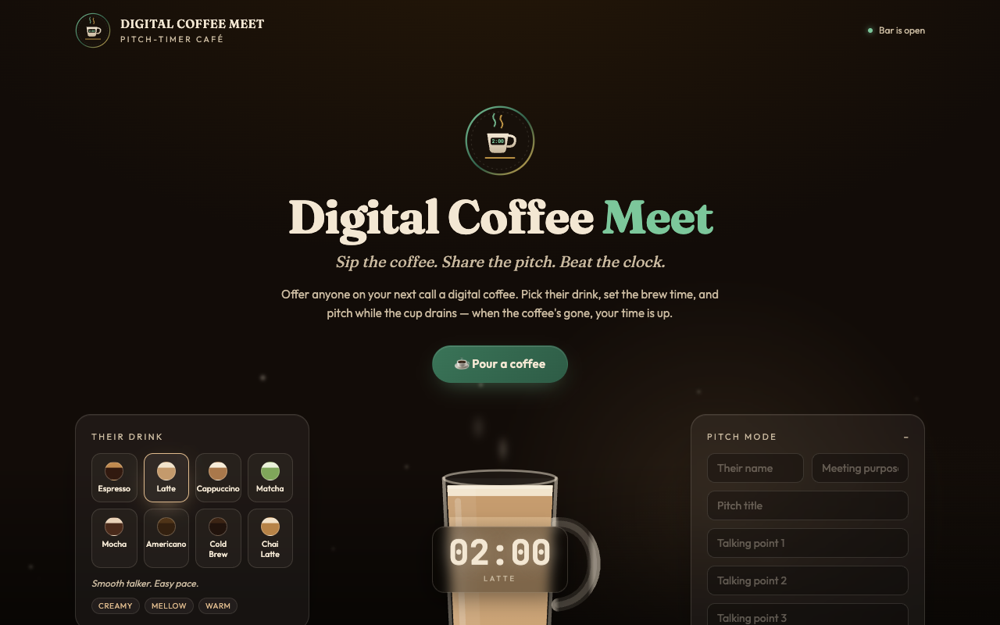
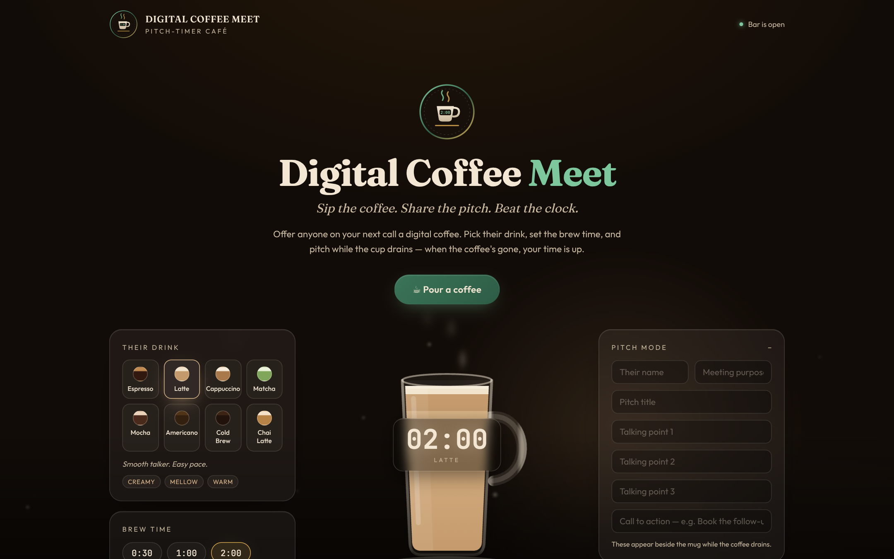
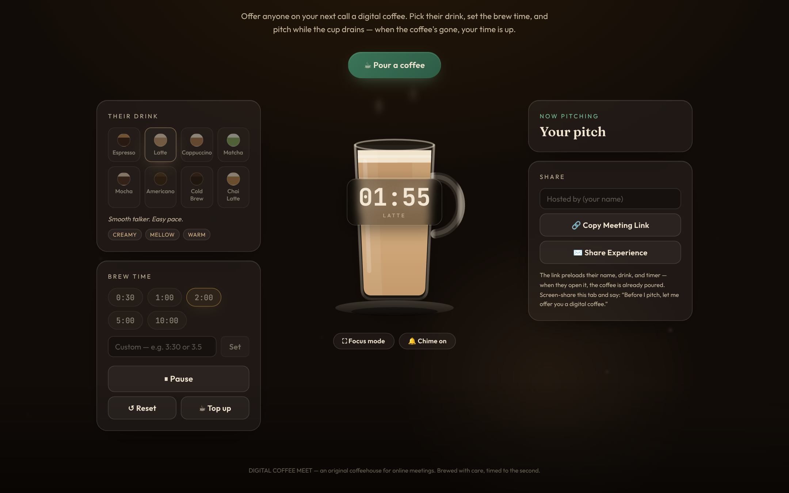
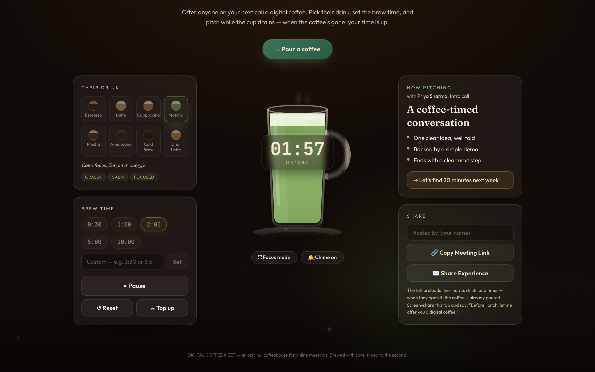
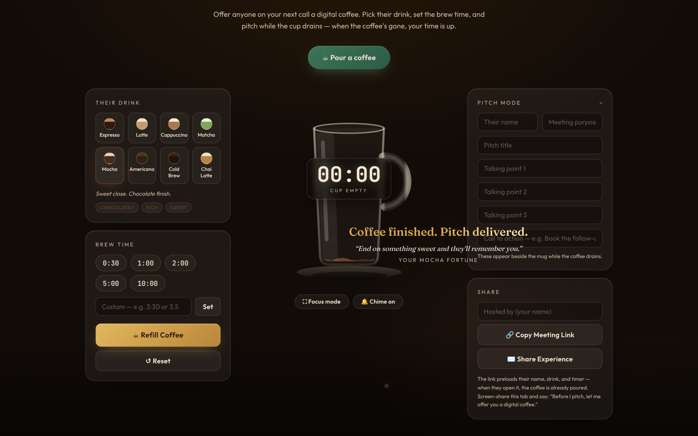

# ☕ DIGITAL COFFEE MEET

**Sip the coffee. Share the pitch. Beat the clock.**

A premium digital coffee timer for online meetings, networking calls, and pitches. Screen-share it on Zoom, Google Meet, or Microsoft Teams and say: *"Before I pitch, let me offer you a digital coffee."* Pick their drink, set the brew time, and pitch while a realistic glass mug slowly drains — when the coffee's gone, your time is up.

**Live demo:** `https://abhishekyadav2000.github.io/digital-coffee-meet/`



## ✨ Features

- **Animated glass mug** — transparent SVG mug with a dual-layer wave surface; liquid height = `remainingTime / totalTime`
- **8 café drinks** — Espresso, Latte, Cappuccino, Matcha, Mocha, Americano, Cold Brew (with bobbing ice), Chai Latte — each with its own liquid color, foam depth, steam, aroma tags, and ambient background mood
- **Digital countdown clock** floating in the center of the mug
- **Brew-time presets** (0:30 / 1:00 / 2:00 / 5:00 / 10:00) plus custom input (`3:30` or `3.5`) with inline validation
- **Urgency mode** — gold-ember glow and clock pulse in the final 10 seconds
- **Coffee fortune** — each cup ends with a warm, drink-specific closing line for a memorable finish
- **Pitch Mode** — enter their name, meeting purpose, pitch title, 3 talking points, and a CTA; shows as a live card beside the mug during the countdown
- **Shareable invite links** — the link preloads the guest's name, drink, and timer, so when they open it the coffee is already poured, with a "poured you a coffee" welcome banner
- **Focus mode** — hides everything but the mug for a clean, distraction-free screen-share
- **Finish chime** — a soft three-note chime when the coffee runs out (toggleable)
- **Keyboard shortcuts** — `Space` start/pause · `R` refill · `F` focus mode · `Esc` exit focus
- **Controls** — Start · Pause · Resume · Reset · Refill Coffee
- Fully responsive (desktop / tablet / mobile), glassmorphism UI, floating steam particles, `prefers-reduced-motion` respected, keyboard-accessible

## 📸 Screenshots

| Landing hero | Mug mid-countdown |
|---|---|
|  |  |

| Pitch mode live | Finished + coffee fortune |
|---|---|
|  |  |

## 🚀 Run it locally

```bash
npm install
npm run dev
```

Open the printed local URL, share your screen, and pour a coffee.

```bash
npm run build     # production build in /dist
npm run preview   # preview the production build
```

## 🌐 Deploy to GitHub Pages (automatic)

This repo ships with a GitHub Actions workflow (`.github/workflows/deploy.yml`) that builds and publishes to GitHub Pages on every push to `main`.

1. Push this project to a GitHub repo named **`digital-coffee-meet`**.
2. In the repo, go to **Settings → Pages**.
3. Under **Build and deployment → Source**, choose **GitHub Actions**.
4. Push to `main` (or re-run the workflow). Within ~1 minute your site is live at:
   `https://<your-username>.github.io/digital-coffee-meet/`

The Vite `base` is set to `/digital-coffee-meet/` for GitHub Pages builds (via the `GITHUB_PAGES` env in CI) and `/` for other hosts like Vercel.

## 🛠 Tech

- React 18 + Vite 6
- Tailwind CSS + a custom CSS design system
- Self-hosted fonts (Fraunces, Outfit, JetBrains Mono) — no external CDN
- Hand-built SVG mug, waves, steam, logo, and favicon — no image assets, no animation libraries
- Web Audio API for the finish chime — no sound files

## 🎨 Brand

Original coffeehouse identity: dark roast `#120C08`, cream `#F3E7D3`, café green `#2E5C46`, leaf `#7CC79B`, brushed gold `#D9A94E`. Type: Fraunces (display), Outfit (body), JetBrains Mono (clock). Circular logo with a coffee cup, steam, and a digital clock chip — fully original, no third-party trademarks.

## ✅ Quality

Verified with a 35-check end-to-end browser test suite covering timer math, pause/resume integrity, input validation, state locking, urgency + finish states, shared-link hydration, focus mode, keyboard shortcuts, accessibility, and responsive layouts at mobile/tablet/desktop widths.

## 📄 License

MIT — do whatever brews your coffee.
